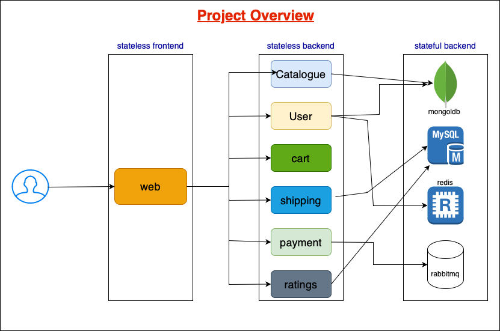

# Roboshop: Continuous Deployment Pipeline for a Hybrid Application

## Overview

This Capstone Project is aimed at developing and implementing a robust Continuous Integration/Continuous Deployment (CI/CD) pipeline for a hybrid application, combining microservices and serverless components. The pipeline automates the building, testing, and deployment processes into a Kubernetes cluster and a serverless platform, specifically AWS Lambda.

## Project Steps

### Step 1: Infrastructure Provisioning with Terraform

**1.1. AWS Infrastructure Setup with Terraform:**
- Leverage Terraform to define and provision AWS infrastructure resources, including VPC, subnets, security groups, and IAM roles.
- Create an Amazon EKS Kubernetes cluster to support the microservices.
- Configure additional resources such as AWS Lambda, API Gateway, and DynamoDB for the serverless components.

### Step 2: Microservices Development

**2.1. Microservices Development:**
- Develop microservices for the application, including User Service, Product Service, Order Service, and Frontend Service, choosing your preferred programming language or framework (e.g., Node.js, Python, Java).
- Ensure that each microservice has its Dockerfile for containerization.

**2.2. Containerization:**
- Create Dockerfiles for each microservice to enable containerization.
- Build Docker images for each microservice, ensuring that they encapsulate the microservices' functionality and dependencies.
- Push the Docker images to a container registry such as Amazon ECR for easy retrieval during deployment.

### Step 3: Jenkins Setup

**3.1. Jenkins Server Provisioning:**
- Deploy Jenkins on an EC2 instance through terraform for running Jenkins as an orchestrator of the CI/CD pipeline.
- setup the **sonarqube server** and create the project to set the quality gates for checking the code has any bug or vulnerability
## Jenkins Plugins and Requirements

This project relies on several essential Jenkins plugins to facilitate various integrations and execute critical tasks:

- **Docker Plugin**: Enables Docker container integration for building and publishing Docker images.
- **Kubernetes Continuous Deploy Plugin**: Facilitates Kubernetes deployments by deploying microservices.
- **Kubernetes CLI Plugin**: Allows the execution of `kubectl` commands for managing Kubernetes resources.
- **AWS Steps Plugin**: Utilized for interacting with AWS services using AWS CLI commands and SDKs.
- **AWS Lambda Plugin**: Manages AWS Lambda functions, making it possible to integrate serverless components.
- **Git Plugin**: Used for version control system integration, particularly for source code management.
- **Pipeline Plugin**: Provides a framework for defining the CI/CD pipeline as code, allowing a structured approach to pipeline configuration.
- **Credentials Plugin**: Facilitates secure management of credentials for integration and interaction with various services.
- **SonarQube Scanner Plugin**: Integrates Jenkins with SonarQube for code analysis.
- **unit Testing Plugins**: Use language-specific unit testing plugins

### Step 4: CI/CD Pipeline Configuration in Jenkins

**4.1. Jenkins Pipeline Configuration:**
- Create a Jenkins pipeline (Jenkinsfile) to define and configure the CI/CD workflow.
- Organize the pipeline into stages, including those for building, testing, and deploying the microservices.
- Integrate Docker commands for building Docker images and publishing them to a Docker container registry.

**4.2. Automated Testing:**
- Implement automated tests to ensure the quality and functionality of the application. These tests may include unit and integration tests.
- Utilize tools such as JUnit, and SonarQube for code quality checks and bug identification.

**4.3. Kubernetes Deployment:**
- Employ Kubernetes configuration files (YAML) to define deployment and service objects for the microservices.
- Deploy the microservices to the Kubernetes cluster.

### Step 5: Serverless Component Deployment

**5.1. Serverless Deployment:**
- Define AWS Lambda functions for the Order and Notification services, which are essential serverless components of the application.
- Configure API Gateway endpoints for these Lambda functions to enable HTTP access to serverless services.

**5.2. Microservices-Serverless Integration:**
- Ensure that the microservices can seamlessly communicate with the serverless components, creating a cohesive application architecture.

### Step 6: Pipeline Triggering

**6.1. Automation:**
- Configure Jenkins
- create a webhook in github and integrate to the jenkins 
